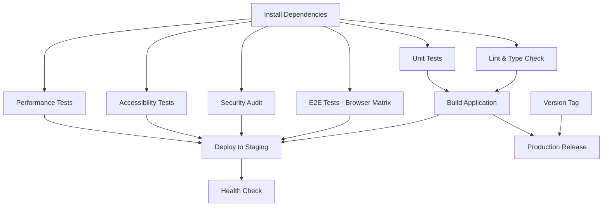

# 🚀 CI/CD Pipeline Implementation Summary

## 📦 What Was Created

### GitHub Actions Workflows

1. **`ci.yml`** - Main CI/CD Pipeline
   - **Triggers:** Push to main/develop, PRs to main
   - **Jobs:** 9 parallel jobs including install, lint, unit tests, E2E tests, build, security, accessibility, performance
   - **Duration:** ~8-12 minutes
   - **Features:** Dependency caching, parallel execution, artifact uploads

2. **`deploy.yml`** - Production Deployment Pipeline  
   - **Triggers:** Push to main, version tags, manual dispatch
   - **Jobs:** Pre-deployment validation, production builds, smoke tests, GitHub releases, staging deployment, health checks
   - **Features:** Automated releases, staging deployments, health monitoring

3. **`security.yml`** - Security & Dependency Management
   - **Triggers:** Weekly schedule (Mondays), dependency changes, manual dispatch
   - **Jobs:** Security audits, license compliance, dependency updates, CodeQL analysis, Docker scanning
   - **Features:** Automated security monitoring, compliance reporting

4. **`matrix-tests.yml`** - Cross-Platform Testing
   - **Triggers:** Weekly schedule (Sundays), push to develop, manual dispatch
   - **Jobs:** Node.js matrix testing, browser compatibility, performance benchmarking
   - **Coverage:** Node 18/20/21 × Ubuntu/Windows/macOS × Chrome/Firefox/Safari

5. **`badges.yml`** - Status Badge Generation
   - **Triggers:** CI completion, manual dispatch
   - **Jobs:** Generate and update status badges for README
   - **Features:** Automated badge updates, test coverage display

## 🎯 Pipeline Features

### ✅ Comprehensive Testing
- **Unit Tests:** 55 tests with Vitest
- **E2E Tests:** 144 tests with Playwright across 3 browsers
- **Accessibility:** WCAG 2.1 AA compliance with axe-core
- **Performance:** Core Web Vitals monitoring
- **Security:** npm audit, CodeQL, dependency scanning

### ⚡ Performance Optimizations
- **Dependency Caching:** Cached node_modules for faster builds
- **Parallel Execution:** Browser tests run in parallel
- **Matrix Testing:** Multi-platform validation
- **Artifact Management:** Build outputs and test results preserved

### 🛡️ Security & Quality Gates
- **Automated Security Scans:** Weekly vulnerability detection
- **Code Quality:** ESLint, TypeScript validation
- **License Compliance:** Dependency license checking  
- **Access Control:** Proper GitHub token management

### 📊 Monitoring & Reporting
- **Test Results:** Detailed reports with screenshots and traces
- **Coverage Reports:** Codecov integration
- **Performance Metrics:** Core Web Vitals tracking
- **Security Reports:** Vulnerability and compliance summaries

## 🔄 Workflow Dependencies



## 📋 Pipeline Status Validation

### Success Criteria
All jobs must pass for successful deployment:
- ✅ Code quality (linting, TypeScript)
- ✅ Unit tests (55/55 passing)
- ✅ E2E tests (144 tests across browsers)
- ✅ Security audit (no high/critical vulnerabilities)
- ✅ Accessibility compliance (WCAG 2.1 AA)
- ✅ Performance thresholds (Core Web Vitals)
- ✅ Production build success

### Failure Handling
- 🔍 Artifacts uploaded for debugging
- 📊 Test reports with detailed failures
- 🖼️ Screenshots and traces for E2E failures
- 📝 Comprehensive error logs

## 🚀 Deployment Strategy

### Staging Deployment
- **Trigger:** Every push to main branch
- **Process:** Validation → Build → Smoke Tests → Deploy → Health Check
- **URL:** Configurable for your hosting service

### Production Releases
- **Trigger:** Git tags (e.g., `v1.0.0`)
- **Process:** Full validation → Production build → GitHub Release → Artifacts
- **Features:** Automated release notes, downloadable builds

## 🔧 Configuration Options

### Required Setup
1. **GitHub Repository:** Enable Actions in settings
2. **Branch Protection:** Require status checks on main branch
3. **Secrets (Optional):** For deployment and enhanced reporting
   ```
   CODECOV_TOKEN       # Coverage reporting
   VERCEL_TOKEN        # Deployment (if using Vercel)
   ORG_ID, PROJECT_ID  # Hosting service IDs
   ```

### Customization
- **Node.js Versions:** Modify matrix in workflows
- **Test Browsers:** Add/remove from Playwright config
- **Performance Thresholds:** Adjust in performance tests
- **Security Levels:** Configure audit levels
- **Schedule:** Modify cron expressions for automated runs

## 📊 Expected Results

### Daily Development
- **PRs:** Automated testing on all pull requests
- **Main Branch:** Full CI/CD pipeline on every commit
- **Feedback:** Fast feedback within 8-12 minutes

### Weekly Maintenance
- **Security Scans:** Monday morning vulnerability reports
- **Compatibility Tests:** Sunday cross-platform validation
- **Dependency Updates:** Automated outdated package detection

### Production Releases
- **Tagged Releases:** Automated GitHub releases with artifacts
- **Smart Release Notes:** Automatic generation from commits, or manual override
- **Deployment Validation:** Comprehensive health checks
- **Rollback Support:** Previous builds available as artifacts

## 🎉 Benefits Achieved

### For Developers
- 🚀 **Fast Feedback:** Quick CI results for rapid iteration
- 🔍 **Comprehensive Testing:** Confidence in code quality
- 🛡️ **Security Monitoring:** Automated vulnerability detection
- 📊 **Quality Metrics:** Performance and accessibility tracking

### For Project Management
- 📈 **Reliability:** Consistent build and test processes
- 🔄 **Automation:** Reduced manual deployment overhead
- 📋 **Compliance:** WCAG 2.1 AA and security standards
- 📊 **Reporting:** Detailed test and performance reports

### For End Users
- ⚡ **Performance:** Optimized builds with Core Web Vitals monitoring
- ♿ **Accessibility:** WCAG 2.1 AA compliant interface
- 🔒 **Security:** Regular vulnerability scanning and updates
- 🌐 **Compatibility:** Cross-browser and cross-platform testing

## 🚀 Next Steps

1. **Push to GitHub:** Commit the workflow files to enable CI/CD
2. **Configure Secrets:** Add deployment tokens if needed
3. **Test Pipeline:** Create a PR to validate the workflows
4. **Monitor Results:** Review initial pipeline runs
5. **Customize:** Adjust thresholds and configurations as needed

The Gloomhaven Digital Game Engine now has enterprise-grade CI/CD infrastructure supporting continuous integration, automated testing, security monitoring, and reliable deployments! 🎲✨